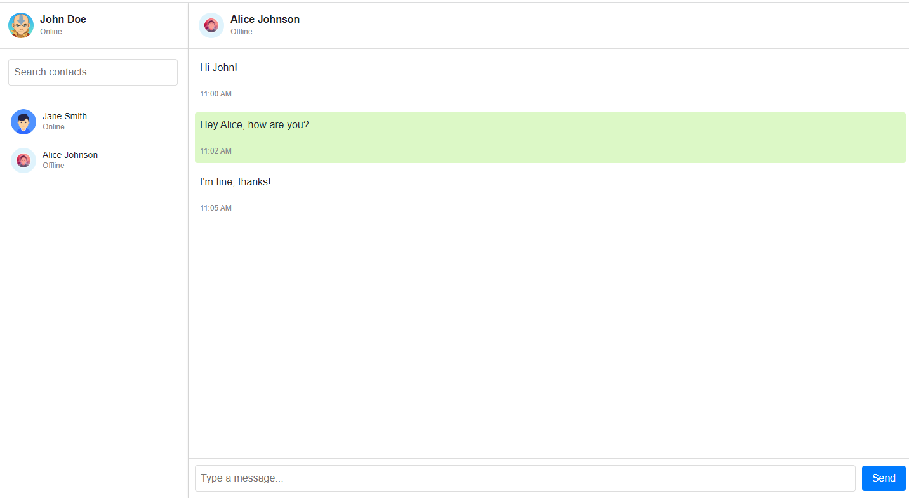

# WhatsApp Web Clone

This project is a clone of the WhatsApp Web user interface, implemented using HTML, CSS, and JavaScript. It aims to replicate the look and feel of the WhatsApp Web application, allowing users to view fake chat conversations and simulate sending and receiving messages.

## Features

- Replica UI: The project closely mimics the UI of the WhatsApp Web application, including the sidebar with contact list, chat window, and message input area.
- Responsive Design: The UI is designed to be responsive and adapt to different screen sizes, ensuring a consistent experience across devices.
- Fake Chats: The chat window displays multiple users with fake chat conversations, providing a realistic representation of the WhatsApp UI.
- Sending and Receiving Messages: The project includes functionality to simulate sending and receiving messages within the fake chat conversations.
- Image Attachments: Users can simulate sending image attachments by clicking on the image icon and selecting an image file from their device.
- Message Timestamps: Each message displays a timestamp indicating when it was sent or received.
- Hover Effects: Interactive hover effects are implemented for contact list items and buttons to enhance the user experience.

## Screenshot

## Usage

To use the WhatsApp Web clone:

1. Clone or download the project files to your local machine.
2. Open the `index.html` file in a web browser.
3. Interact with the UI by clicking on contact list items to open respective chat sections and simulate sending/receiving messages.
4. Click on the image icon in the message input area to simulate sending image attachments.
5. Scroll through the chat conversations and observe the responsive design behavior.

## Project Structure
index.html --> HTML structure of the WhatsApp Web clone
styles.css --> CSS styles for the UI components
script.js --> JavaScript code for simulating sending and receiving messages
avatar.jpg --> Sample avatar image used in the UI

## Contributions

Contributions to the project are welcome. If you find any bugs or have suggestions for improvements, please open an issue or submit a pull request on the GitHub repository.

## License

This project is licensed under the [MIT License](LICENSE).

## Acknowledgments

The design and layout of the WhatsApp Web clone were inspired by the official WhatsApp Web application.

## Keywords

WhatsApp Web, Clone, HTML, CSS, JavaScript, Responsive Design, Fake Chats, Messaging, UI, Open Source
